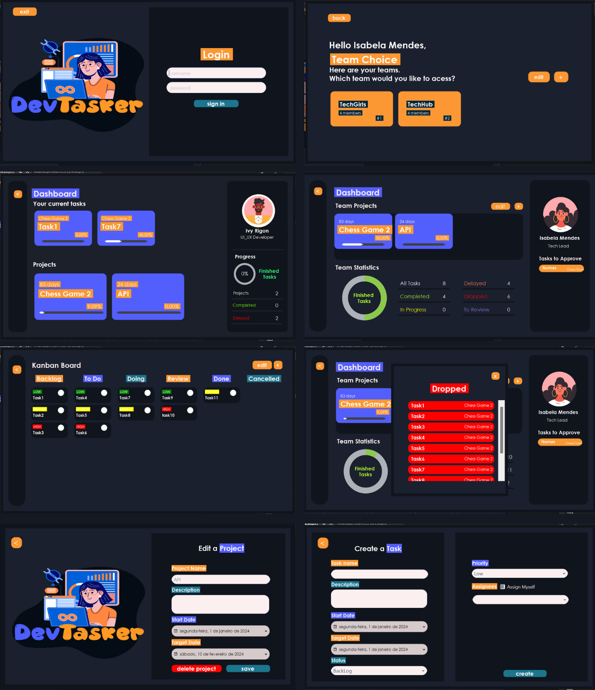

Seja bem vindo ao meu repositório da aplicação DevTasker, um aplicativo intuitivo e prático desenvolvido pra simplificar a gestão de times de desenvolvedores. No DevTasker, existem dois tipos de usuário: TechLead e Developer, sendo o primeiro mais poderoso que o segundo.
O aplicativo permite com que time acompanhe diversos projetos, visualizando tanto de maneira geral quanto individual, facilitando o desenvolvimento.

## Índice
- 🔨 [Funcionalidades](#-funcionalidades)
- 📁 [Estrutura de diretórios](#-estrutura-de-diretórios)
- 💻 [Técnicas e tecnologias utilizadas](#-técnicas-e-tecnologias-utilizadas)
- 🔧 [Como executar](#-como-executar)
- 👥 [Autores](#-autores)

# 🔨 Funcionalidades

  

-**Cadastro de Time 👥:** O TechLead tem o poder de criar diferentes times, cadastrando os Desenvolvedores disponíveis como membros.

-**Gerenciamento de Time ⚙️:** É possível adicionar ou remover membros de um time e ainda excluir o time completamente.

-**Estatísticas visuais 📊:** Através de estatísticas visuais, o TechLead pode acompanhar o desempenho do time como tarefas completadas, em progresso, atrasadas, abandonadas e em fase de revisão.

-**Quadro Kanban do Projeto 📈:** Os usuários podem visualizar o quadro Kanban de cada projeto.

-**Armazenamento em JSON: 📁** Os dados dos usuários e times são armazenados em um arquivo JSON, permitindo a persistência de dados.

-**Gerenciamento de Projetos e Tarefas 📋:** Os usuários podem criar, editar, e excluir tarefas e projetos. Além disso, é possível atribuir tarefas a membros específicos do time, facilitando a distribuição de responsabilidades.

-**Sistema de Aprovação de Tarefas ✅:** Desenvolvedores têm a capacidade de editar tarefas, mas qualquer modificação requer a aprovação do TechLead. Isso garante um controle rigoroso sobre as alterações e mantém a integridade do projeto.

-**Visualização Estatística de Tarefas 📊:** Os usuários podem visualizar estatísticas detalhadas sobre as tarefas, incluindo aquelas completadas, em andamento, atrasadas, abandonadas e em fase de revisão. Isso fornece uma compreensão abrangente do progresso do projeto.

-**Criptografia de Senhas 🔐:** As senhas dos usuários são criptografadas para garantir a segurança das informações confidenciais.

-**Dashboard para TechLead e Developer 📈:** O aplicativo oferece dashboards distintos para TechLead e Developers. O TechLead pode acessar informações mais abrangentes sobre o desempenho do time, enquanto os Developers têm uma visão mais específica de suas tarefas e projetos.

-**Carregamento de JSON: ⬆️** Todos os usuários, times, tarefas e projetos são carregados a partir de um arquivo JSON, permitindo a recuperação do estado anterior do programa.

Essas funcionalidades combinadas tornam o DevTasker uma ferramenta abrangente e eficaz para a gestão de times de desenvolvedores, proporcionando uma experiência simplificada e intuitiva para todos os usuários envolvidos.

# 📁 Estrutura de diretórios
- **/docs:** Contém a documentação do projeto;
- **/properties:** Centraliza configurações e recursos para personalização da aplicação;
- **/src:** Contém o código fonte do projeto;
- - **/application:** Contém a classe principal da aplicação;
  - **/infrastructure:** Contém os arquivos JSON com os dados de usuários e times;
  - **/model:** Contém os modelos (models) do projeto;
  - **/controller:** Contém os controles (controllers) da aplicação;
  - **/view:** Contém o designer dos Forms do projeto;
  - **/repository:** Repositório envolvendo operações de armazenamento e recuperação de dados;
- **.gitignore:** Arquivo do Git para ignorar arquivos no controle de versão;
- **README.md:** Documentação essencial do projeto em texto;
- **resources:** Contém os recursos utilizados pelo programa como imagens;

# 💻 Técnicas e tecnologias utilizadas

# 🔧 Como executar?

## Pré-requisitos
Certifique-se de ter o Visual Studio instalado em seu sistema antes de prosseguir.

### Passo 1: Obtenha o código-fonte
Clone o repositório do projeto em seu ambiente local ou faça o download dos arquivos fonte em um diretório de sua escolha.

### Passo 2: Abra o projeto no Visual Studio
Abra o Visual Studio e carregue o projeto C# (.csproj) no ambiente de desenvolvimento.

### Passo 3: Compile e Execute o aplicativo
No Visual Studio, clique no botão "Build" para compilar o projeto. Certifique-se de que não há erros durante o processo de compilação.

Após a compilação bem-sucedida, clique no botão "Start" (ou pressione F5) para iniciar a execução do aplicativo.

## 👤 Usuário de exemplo para teste
Para facilitar os testes e a exploração do sistema, usuários de exemplo foram criados com times, projetos e tarefas pré cadastrados

**TechLead**
- Username: isabelam
- Password: isabelam

**Developer**
- Username: matheusv
- Password: matheusv

Estes usuários já possuem times, projetos e tarefas atribuídas. Sinta-se à vontade para explorar as funcionalidades do sistema utilizando estas credenciais de exemplo.

# 👥 Autores

| [ Isabela Gomes](https://github.com/isabelamendesx)  |
| :---: | 

